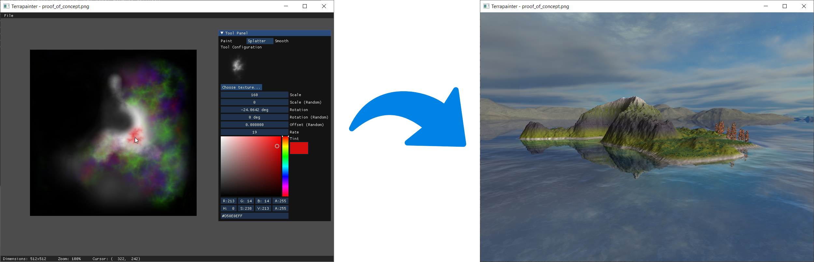

# Terrapainter

Terrapainter is an application which converts a user-painted heightmap into 3D terrain. It was our final project for CS 4621 @ Cornell.

One of our main goals was to understand the complexity of the realtime graphics pipeline. As a result, most functionality was written from scratch — even our math library! Important exceptions: [assimp](https://github.com/assimp/assimp) and [stb](https://github.com/nothings/stb) for asset loading, [SDL2](https://github.com/libsdl-org/SDL) for window management, and [Dear ImGui](https://github.com/ocornut/imgui) for menus and control panels.

## Building

Terrapainter requires C++20 and OpenGL 4.5. It can be built using CMake on Windows (MSVC, G++) and Linux (G++). MacOS and Clang are untested. The CMake build script *should* automatically fetch any missing dependencies, but we've experienced issues with SDL2 on Ubuntu, so manual intervention may be necessary.

The resulting binaries are placed into the `app` subdirectory. If you move the executable, you should copy the entire folder. It contains important runtime dependencies (such as shaders).

## Usage

You can specify initial window coordinates on the command line using `-x` and `-y`. Similarly, you can specify the initial window size with `-w` and `h`. The window is freely resizable.

`CTRL-N`, `CTRL-O`, and `CTRL-S` can be used to create, open, or save a heightmap.

You can pan the canvas by right clicking and dragging, and you can zoom in or out using the scroll wheel.

The brush controls are mostly what you'd expect. For ease of use, certain parameters can be controlled via holding down a key and dragging the mouse. At the time of writing, these are:
- `f`: Radius (all tools)
- `h`: Hardness (paint tool, smooth tool)
- `a`: Alpha (paint tool, splat tool)
- `r`: Texture Rotation (splat tool)
- `s`: Random Spread (splat tool)

To switch between the canvas and the 3D view, press spacebar. You can move around in the 3D view with standard WASD controls. (Holding shift makes you move faster!) Pressing `CTRL-D` opens a camera control menu where you can adjust the camera's precise position, rotation, field of view, and clipping range.

## Asset Credits (Incomplete)
- Terrain Textures
    - https://www.textures.com/
- Water Textures
    - https://c2.staticflickr.com/8/7357/27325610181_f25f6ab77f_z.jpg
    - https://watersimulation.tumblr.com/post/115928250077/scrolling-normal-maps
- Cloud Shader
    - https://www.shadertoy.com/view/4tdSWr
- Tree Model
    - https://www.turbosquid.com/3d-models/yamaboushi-tan-6000-a-3d-model-1814882